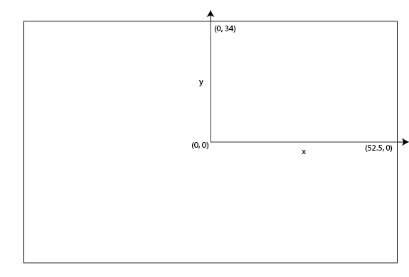

# SkillCorner Open Data

## About this repo

### Description

This repo contains 9 matches of broadcast tracking data collected by [SkillCorner](https://skillcorner.com).

The matches included are the 2019/2020 league matches between the champions and runners up in English Premier League, French L1, Spanish LaLiga, Italian Serie A and German Bundesliga.

Broadcast tracking data is tracking data collected through computer vision and machine learning out of the broadcast video.

To find out more about broadcast tracking data and its use cases, read this [Medium article](https://medium.com/skillcorner/a-new-world-of-performance-insight-from-video-tracking-technology-f0d7c0deb767).

### Motivation

This data has been open sourced in a joint initiative between [SkillCorner](https://skillcorner.com) and [Friends Of Tracking](https://www.youtube.com/channel/UCUBFJYcag8j2rm_9HkrrA7w). The goals are multiple:
* Provide access to tracking data to researchers and the sports analytics community.
* Increase awareness on the existence of broadcast tracking data, and how it can be of benefit to clubs, media and the betting industry.
* Allow SkillCorner prospects to access data easily, parse our data format and get started building on top of it.

Thus, if you use the data, we kindly ask that you credit SkillCorner and hope you'll notify us on [Twitter](https://twitter.com/skillcorner) so we can follow the great work being done with this data.

## Documentation

### Data Structure

The `data` directory contains:

* `matches.json` file with basic information about the match. Using this file, pick the `id` of your match of interest.
* `matches` folder with one folder for each match (named with its `id`).

For each match, there is two files:

* `match_data.json` contains lineup information, referee, pitch size...
* `structured_data.json` contains the tracking data (the players, the main referee and the ball).

### Tracking Data Description

The tracking data is a list. Each element of the list is the result of the tracking for a frame, it's a dictionary with keys:

* period: 1 or 2.
* frame: the frame of the video the data comes from at 10 fps.
* timestamp: the timestamp in the match time with a precision of 1/10s.
* data: the tracking data found at this frame. It's a list.
* possession: dict with keys trackable_object and group which indicates which team/player possess the ball

Each element of the data list is an "object" (referee, ball or player) found at this frame. It's a dictionary with keys:

* group_name: one of "home team", "away team", "home goalkeeper", "away goalkeeper", "referee", "ball"
* trackable_object: unique identifier of an object (to be matched with a player or a referee or the ball in `match_data.json` file)
* track_id: when we track an "object" on consecutives frames, it is attributed a track_id. This can be used for further smoothing, speed or acceleration calculation.
* x: x coordinate of the object
* y: y coordinate of the object
* z: z coordinate of the object (only for the ball)

Note that `trackable_object` is included when the player has been identified with a high degree of certainty. `group_name` is not included in this case. Otherwise, only `group_name` is included.

For the spatial coordinates, the unit of the field modelization is the meter, the center of the coordinates is at the center of the pitch.

The x axis is the long side and the y axis in the short side.

Here is an illustration for a field of size 105mx68m.

### Limitation

The data has been processed as SkillCorner produced matches from over 20 leagues (more than 8000 matches this season). The data has been collected automatically from the broadcast and has not received any manual correction. What it means for user:

* The data is limited to what is visible on the broadcast video. Not all the players are visible (thus included in the data) all the time. The broadcast show an average of 14 players out of 22 at each frame. During replays or close up views, the data is not included.
* Some data points are erroneous. Around 95% of the player identity we provide are accurate. For the missing 5%, the identity of the player may be missing (we only provide the `group_name`), or the identity can be provided, but wrong.
* Some speed or acceleration smoothing and control should be applied to the raw data.

## Future works

* We intend to open source some tooling to help people get started with our data.
* We are not an event data provider ourself, though we intend to provide some tools to synchronize tracking and event data, that you'll be able to use if you can access event data.

## Contact us

* If you have some feedback, some project research that you want to conduct with our data, reach us on [our website](https://skillcorner.com/#contact-section) or on [Twitter](https://twitter.com/skillcorner)
* If you're interested in our product and want more commercial information contact us on [our website](https://skillcorner.com/#contact-section)
