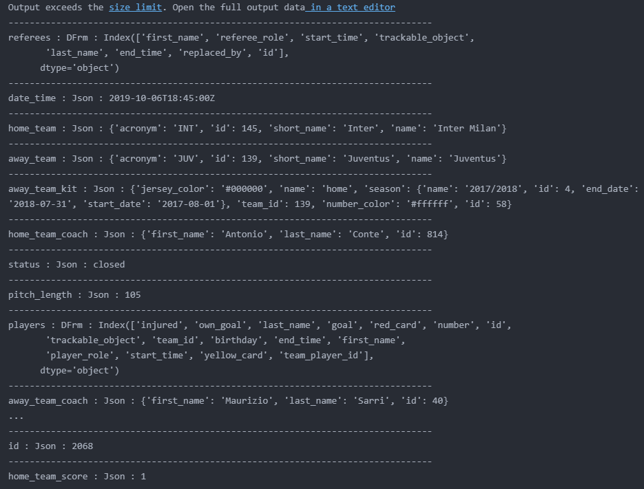
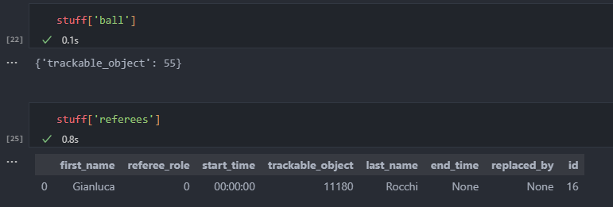
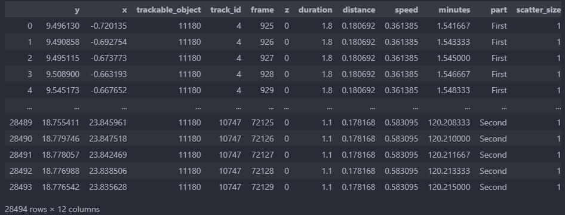
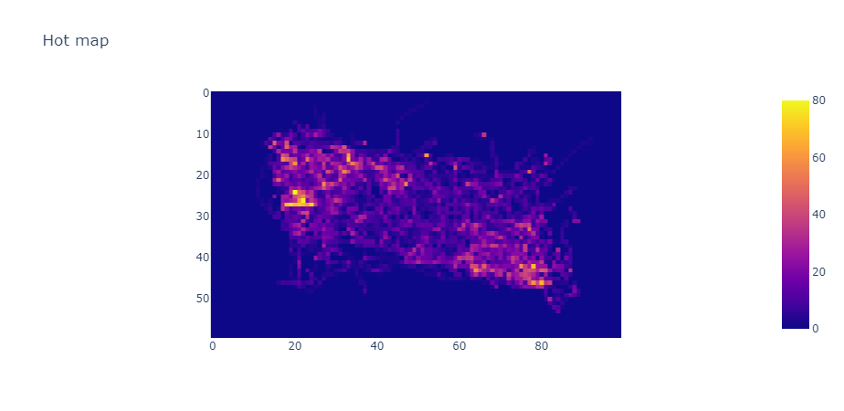
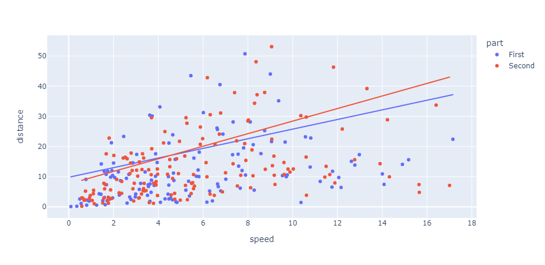
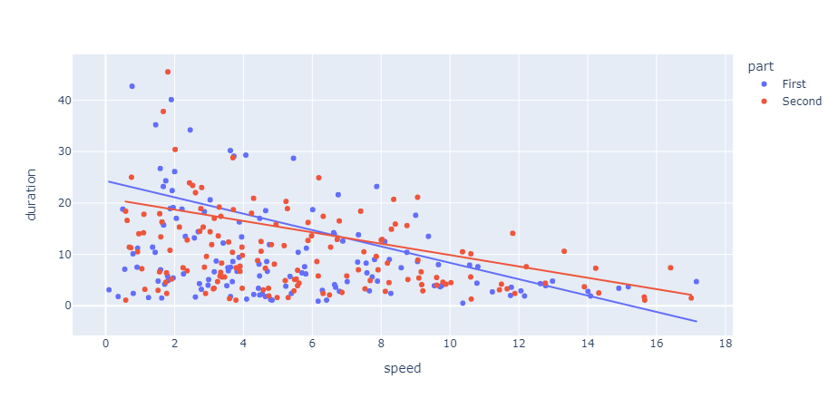
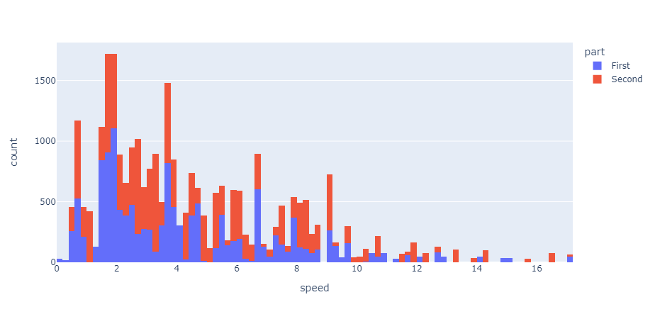
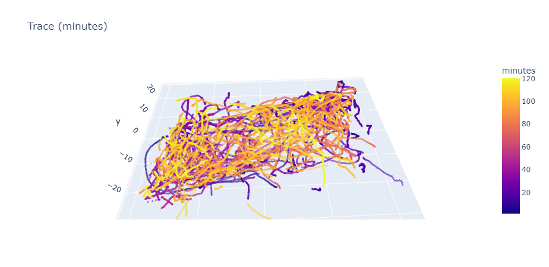
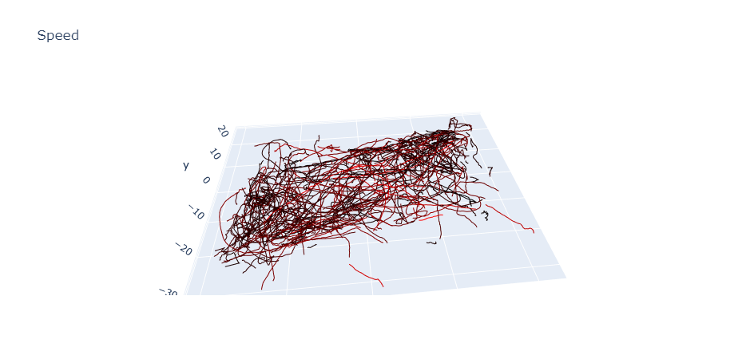

# Football event visualization

The [readme.ipynb](./readme.ipynb) is developed to visualize the football match events.

The raw dataset is parsed into the **stuff**

The stuff contains all the information.
For example, if you select the ball (55) or the referee (11180)

the events are processed and turned into the dataframe as the well-formatted

Based on it, the following visualization is made to but not limited to

-   The hot map of events
    

-   The relationship between speed and distance
    

-   The relationship between speed and duration
    

-   The histogram of the speed
    

-   The trace scatters in every frame (the fps is 10)
    

-   The trace line colored by the speed
    

## Acknowledgement

The data is collected in the github repository,
https://github.com/SkillCorner/opendata.git,
read the [readme-origin.md](./README-origin.md) for detail.
